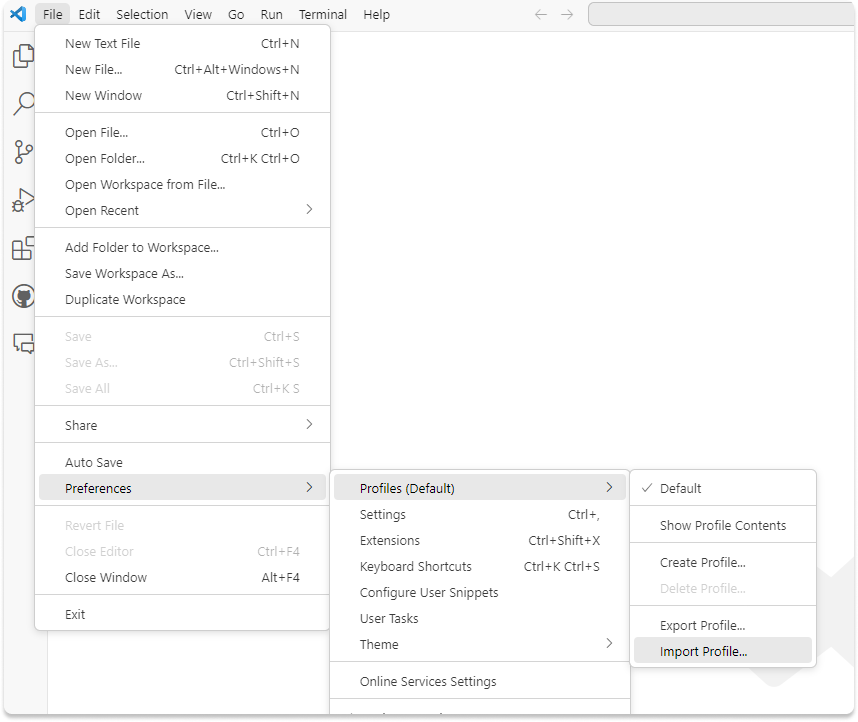
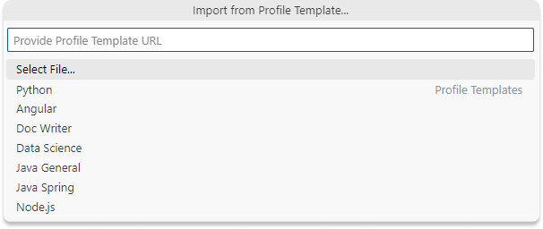
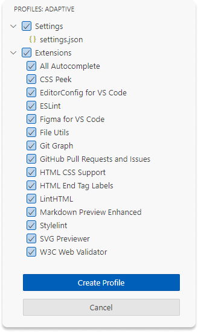
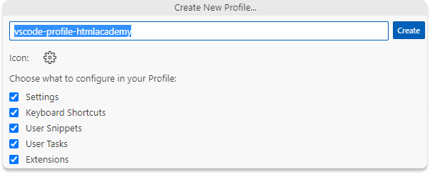

# vscode-profile-htmlacademy
Отличный базовый профиль для VS Code для комфортного прохождения курсов, а также отличный стартовый набор для начинающий для работы в VS Code.

## Как установить
1. [Скачать файл профиля](https://raw.githubusercontent.com/htmlacademy/vscode-profile-htmlacademy/main/adaptive.code-profile)
2. Добавить профиль в VS Code `File -> Preferences -> Profiles -> Import Profile`

3. В меню выбора указать скачанный файл профиля

4. Создать профиль, нажав "Create profile"

5. Принять конфигурационный файл, нажмите "Create"

6. Немного, меньше минуты, подождите пока загрузятся все расиширения
7. Пользуйтесь

## Extensions (Расширения)
В профиле уже есть набор расширений для комфортной работы:
- All Autocomplete
- CSS Peek
- EditorConfig for VS Code
- ESLint
- Figma for VS Code
- File Utils
- Git Graph
- Github Pull Requests and Issues
- HTML CSS Support
- HTML End Tag Labels
- LintHTML
- Markdown Preview Enhanced
- Stylelint
- SVG Previewer
- W3C Web Validator

## Настройки
