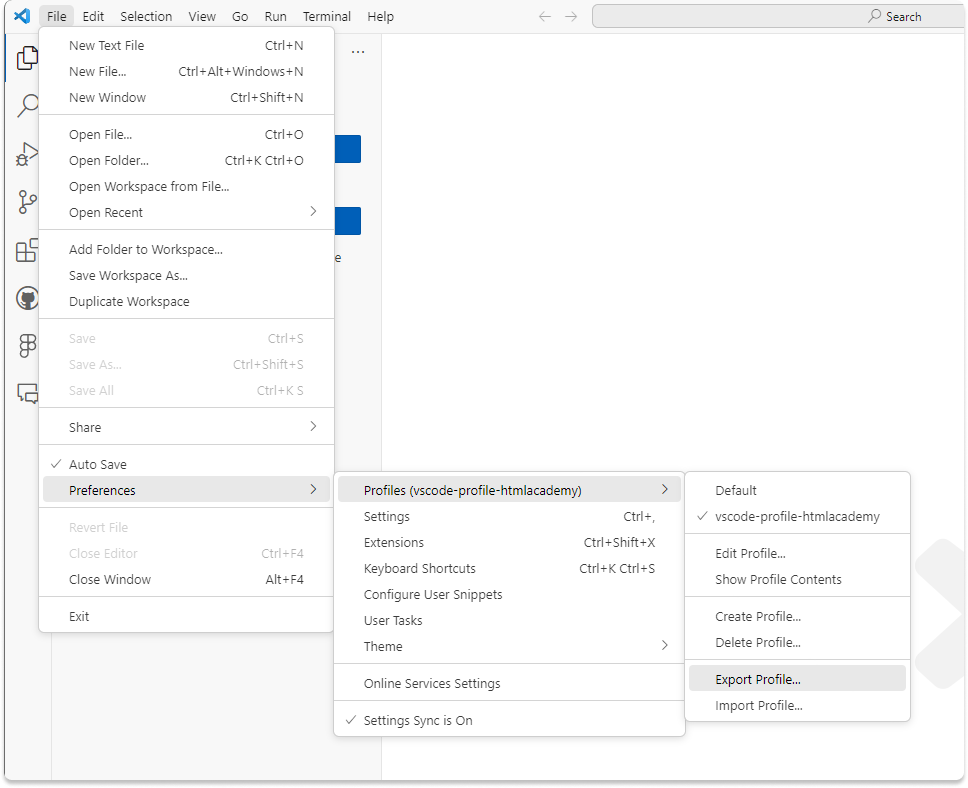

# vscode-profile-htmlacademy
Отличный базовый профиль для VS Code для комфортного прохождения курсов, а также отличный стартовый набор для начинающий для работы в VS Code.

## Как установить
1. [Скачать файл профиля](https://raw.githubusercontent.com/htmlacademy/vscode-profile-htmlacademy/main/vscode-profile-htmlacademy.code-profile)
2. Добавить профиль в VS Code `File -> Preferences -> Profiles -> Import Profile`

   

3. В меню выбора указать скачанный файл профиля

   

4. Создать профиль, нажав "Create profile"

  

5. Принять конфигурационный файл, нажмите "Create"

  

6. Немного, меньше минуты, подождите пока загрузятся все расширения
7. Пользуйтесь

## Extensions (Расширения)
В профиле уже есть набор расширений для комфортной работы:
- [All Autocomplete](https://marketplace.visualstudio.com/items?itemName=Atishay-Jain.All-Autocomplete)
- [CSS Peek](https://marketplace.visualstudio.com/items?itemName=pranaygp.vscode-css-peek)
- [EditorConfig for VS Code](https://marketplace.visualstudio.com/items?itemName=EditorConfig.EditorConfig)
- [ESLint](https://marketplace.visualstudio.com/items?itemName=dbaeumer.vscode-eslint)
- [File Utils](https://marketplace.visualstudio.com/items?itemName=sleistner.vscode-fileutils)
- [Git Graph](https://marketplace.visualstudio.com/items?itemName=mhutchie.git-graph)
- [Github Pull Requests and Issues](https://marketplace.visualstudio.com/items?itemName=GitHub.vscode-pull-request-github)
- [HTML CSS Support](https://marketplace.visualstudio.com/items?itemName=ecmel.vscode-html-css)
- [HTML End Tag Labels](https://marketplace.visualstudio.com/items?itemName=anteprimorac.html-end-tag-labels)
- [LintHTML](https://marketplace.visualstudio.com/items?itemName=kamikillerto.vscode-linthtml)
- [Markdown Preview Enhanced](https://marketplace.visualstudio.com/items?itemName=shd101wyy.markdown-preview-enhanced)
- [Path Autocomplete](https://marketplace.visualstudio.com/items?itemName=ionutvmi.path-autocomplete)
- [Stylelint](https://marketplace.visualstudio.com/items?itemName=stylelint.vscode-stylelint)
- [SVG Previewer](https://marketplace.visualstudio.com/items?itemName=jock.svg)
- [W3C Web Validator](https://marketplace.visualstudio.com/items?itemName=CelianRiboulet.webvalidator)

## Настройки

## Как предложить изменение в профиль
1. Открыть [issue](https://github.com/htmlacademy/vscode-profile-htmlacademy/issues)
2. Обсудить нужность изменения
3. [Установить профиль в VS Code](https://github.com/htmlacademy/vscode-profile-htmlacademy?tab=readme-ov-file#%D0%BA%D0%B0%D0%BA-%D1%83%D1%81%D1%82%D0%B0%D0%BD%D0%BE%D0%B2%D0%B8%D1%82%D1%8C)
4. В VS Code сделать изменения в профиле
5. Экспортировать профиль `File -> Preferences -> Profiles -> Export Profile`

6. Создать pull request с изменённым файлом профиля
